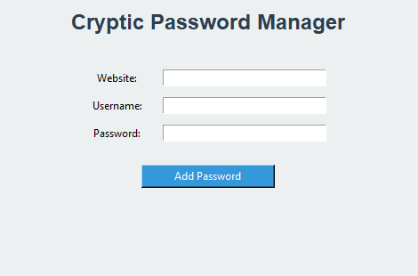
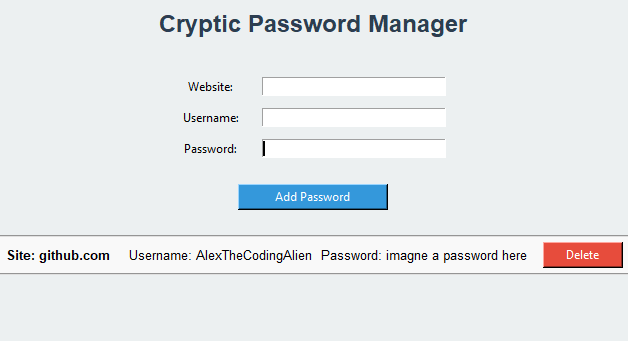

# Cryptic Password Manager

**Cryptic Password Manager** is a simple yet professional password management application built using Python and Tkinter for the graphical user interface (GUI). It allows users to securely store, view, and manage their passwords, with all data saved locally in a JSON file.

## Features

- **Add New Passwords**: Store website credentials including website name, username, and password.
- **View Saved Passwords**: Display stored passwords in a clean and organized list.
- **Delete Passwords**: Easily remove any saved password from the list.
- **Local Storage**: Passwords are saved locally in `passwords.json`, making them accessible across sessions.

## Screenshots

## Installation

### Prerequisites
- **Python 3.x** must be installed on your system.
- Required Python packages: `tkinter`, `json`, and `os`. These are part of Python’s standard library, so no additional installations are needed.

### Steps to Run the Python Script
1. Clone the repository or download the `main.py` file.
2. Open your terminal or command prompt.
3. Navigate to the directory where the script is located.
4. Run the script using the following command:

